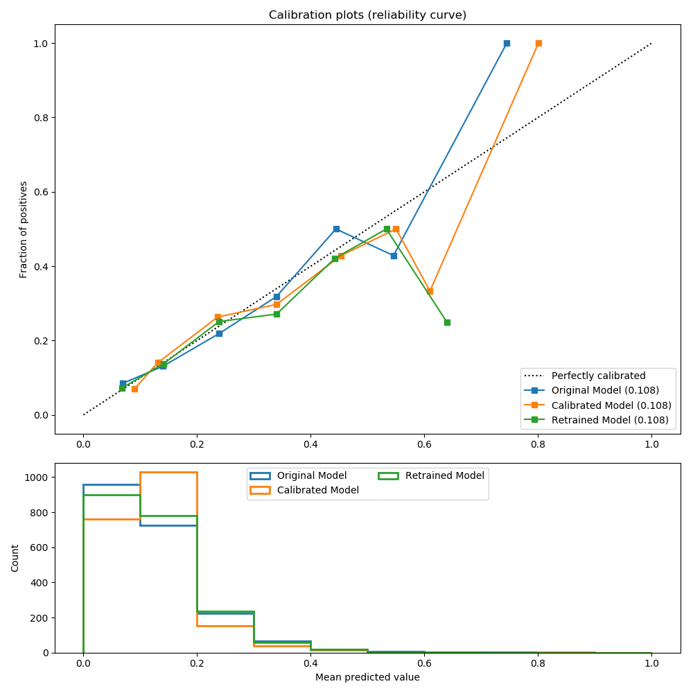

Calibration of models
========================

This project demonstrates how you can take a DataRobot model
and test whether a calibration step will improve the probabilties 
produced by that model.

## Dependencies
 
You will need a DataRobot account and access to a dedicated prediction server.

You will also need a bunch of python libraries, including the DataRobot package

```
pip install numpy
pip install pandas
pip install sklearn
pip install datarobot
```

To run the web application you will need a YAML file that authenticates you against your
DataRobot instance when using the DataRobot Python Package. Please 
[follow these guidelines](https://datarobot-public-api-client.readthedocs-hosted.com/en/v2.7.2/setup/configuration.html)
to set up this this configuration file.


## About

The core functions that build and apply the calibration models can be found in
the file [calibration.py](calibration.py)

The above functions are used by the example script and the web application example.


## Usage

### Pattern One

In this usage pattern you download the scores for the validation and holdout data generated by your model.
You also have a second set of scores on the holdout that were created by training the model on all but the holdout
data (i.e. inlcuding the validation data). When you download these predictions you need to include or join
the original target feature, and the target must be binomial and numeric (i.e. 0 or 1).

We have generated an example dataset generated from a real credit risk problem. In this instance we are trying
predict the probability of default. 

In the script [example.py](example.py) you will see how these scored data sets are used to build an isotonic 
regression calibration model on the validations scores. It then generates the plot shown below that compares
the expected vs. empirical probabilities (Reliability Plot) on the holdout data. 

We apply the calibration to the holdout forecasts from the original model, comapred against the orginal probabilities
output by this model (i.e. validation data is only used for calibration). We add an additional series to show the probabilities
output by a second model retrained to include the validation data (i.e. validation data is used twice,
initially to generate a calibration, and then to retrain the base model). In both instances the forecast is on
holdout data which was not used in the development of either model or calibration.





### Pattern Two

TODO

The file [app.py](app.py) and the contents of the [templates](templates) directory is a python flask 
web application you can use to create a new DataRobot project on a dataset and then apply the calibration.

To run:

```
python app.py
```

Then follow the prompts


